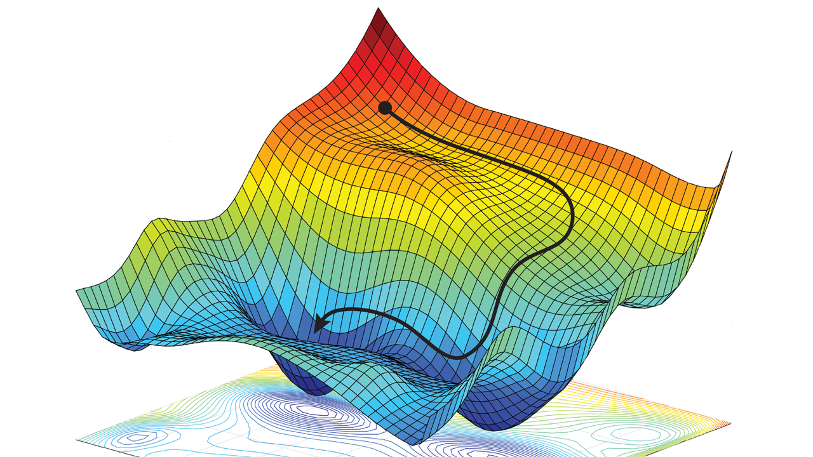
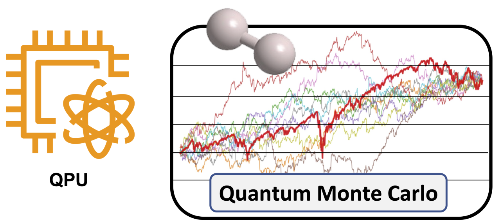

# Autoregressive Quantum Neural Networks (QNNs) with PennyLane

This repository explores the use of **Autoregressive Quantum Neural Networks (QNNs)**, combining quantum computing and autoregressive modeling to capture dependencies in quantum systems. The project leverages controlled rotation gates in quantum circuits and applies these QNNs within a Variational Monte Carlo framework to estimate the ground state energy of a Hamiltonian.

## Features
- **Quantum Circuit Construction**: Design autoregressive circuits with controlled rotation gates.
- **Variational Monte Carlo Framework**: Apply QNNs for energy minimization tasks.
- **Step-by-Step Tutorial**: Detailed instructions for reproducing the implementation.

## References
- Mayshev, A., Arrazola, J. M., & Lvovsky, A. I. (2023). *Autoregressive neural quantum states with quantum number symmetries.* arXiv preprint [arXiv:2310.04166](https://arxiv.org/abs/2310.04166).
- *Variational Monte Carlo.* Wikipedia, 2024. Accessed November 13, 2024. [https://en.wikipedia.org/wiki/Variational_Monte_Carlo](https://en.wikipedia.org/wiki/Variational_Monte_Carlo)
- Dewee, H. (2024). *Gradient Descent: Introduction.* Medium. [https://medium.com/@hosamedwee/gradient-descent-1-introduction-333b1134b023](https://medium.com/@hosamedwee/gradient-descent-1-introduction-333b1134b023)
- *Quantum Monte Carlo on Quantum Computers.* Amazon Web Services Quantum Blog. [https://aws.amazon.com/es/blogs/quantum-computing/quantum-monte-carlo-on-quantum-computers/](https://aws.amazon.com/es/blogs/quantum-computing/quantum-monte-carlo-on-quantum-computers/)

